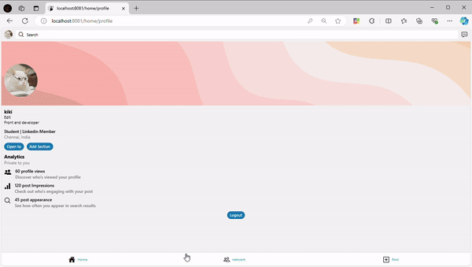

# LinkedIn Clone - MERN Stack Project
This LinkedIn Clone is a full-featured social networking web application built with the MERN stack (MongoDB, Express.js, React, Node.js). Designed to simulate core functionalities of LinkedIn, this project allows users to connect, share, and engage with one another.

# Features 
• User Registration: New users can create an account, with verification emails sent for security.

• Email Verification: Users confirm their email addresses to complete the registration process.

• Login/Logout: Secure user authentication and easy logout functionality.

• Connect with Others: Send and receive connection requests to build your network.

• Like Posts: Interact with posts through a 'Like' feature.

• Create and Share Posts: Users can publish their own posts to share updates with connections.

• Profile Management: Update your bio to personalize your profile.

• Real-time Notifications: Stay updated on connections and interactions

# Tech Stack 
• Frontend: React for responsive and dynamic UI.

• Backend: Node.js and Express.js for the server logic.

• Database: MongoDB for managing user data and posts.

• Authentication: JWT (JSON Web Tokens) for secure login and session management.

# Getting Started
Clone the Repository:

    git clone https://github.com/Prathzzz/Linkedin-Clone.git
Install Dependencies:

    cd Linkedin-Clone
    npm install
Run the Application:

Connect backend:
    
    cd api
    npm install
    npm start

Connect frontend: 
    
    cd app
    npm install
    npm start

# DEMO

